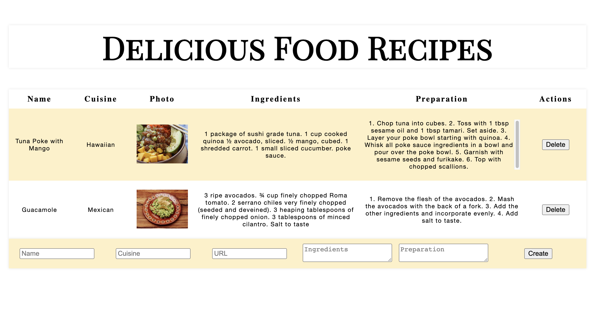

# React-food-recipes-App
React app to add and track recipes

## Project Task:
A CRUD application allows a user to create, read, update or delete selected data. For this project, you will build the interface of a food recipe CRUD app. The interface won't use a database or an API to store the data; it will require you to use React's useState() hook.

- Installing packages via NPM
- Running tests from the command line
- Writing React function components
- Using hooks like useState()
- Debugging React code through console output
- 
- 
- Screen shot of the Page:
 
